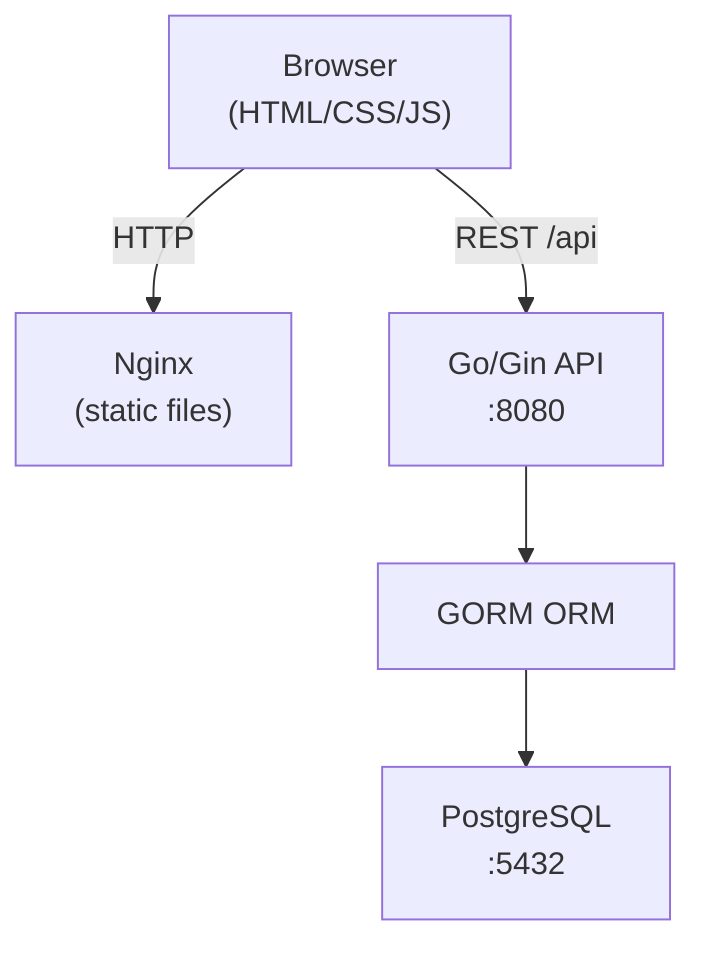
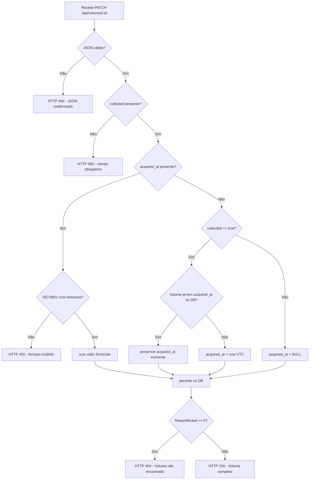
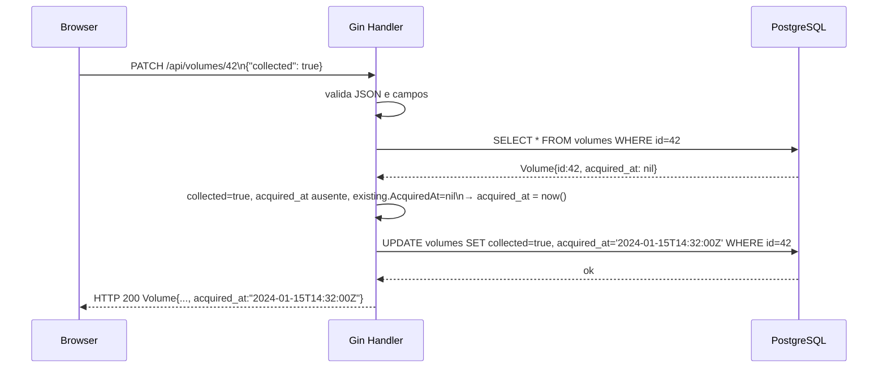

# Design Document — `manga-acquisition-date`

## Overview

Esta feature consolida e formaliza três melhorias na aplicação **One Piece Collection**:

1. **Data de aquisição** (`acquired_at`): garantir que a lógica de persistência no backend Go/Gin/GORM esteja correta e completa, cobrindo todos os casos de borda definidos nos requisitos.
2. **Exibição no Card**: mostrar a data de aquisição formatada em português brasileiro dentro do card de cada volume.
3. **Timeline de navegação**: permitir ao Collector navegar pelos volumes adquiridos agrupados por mês e dia.
4. **Redesign visual**: substituir a paleta monocromática escura pela paleta "Trufa de Chocolate" via variáveis CSS.

O projeto segue a stack: **Go 1.21+ / Gin / GORM / PostgreSQL** no backend, **HTML + CSS + JS vanilla** no frontend, ambos containerizados via Docker Compose.

---

## Architecture

O sistema mantém a arquitetura cliente-servidor já existente:



Não há novos serviços. As mudanças são cirúrgicas em três camadas:

- **Model**: campo `acquired_at` já existe; o design garante a lógica de negócio correta no handler.
- **Handler `UpdateVolume`**: corrigir o comportamento de preservação de `acquired_at` quando o volume já possui o campo preenchido.
- **Frontend**: atualizar `style.css` (paleta + `.volume-acquired`) e `app.js` (lógica de filtro + formatação de data).

---

## Components and Interfaces

### Backend — `models.Volume`

O model já possui `AcquiredAt *time.Time`. Nenhuma alteração de schema é necessária; o GORM já persiste `NULL` corretamente para ponteiros `nil`.

```go
// Sem mudança no struct — já está correto
type Volume struct {
    ID           uint       `json:"id"          gorm:"primaryKey;autoIncrement"`
    VolumeNumber int        `json:"volume_number" gorm:"uniqueIndex;not null"`
    Title        string     `json:"title"`
    CoverImage   string     `json:"cover_image"`
    Chapters     string     `json:"chapters"`
    Collected    bool       `json:"collected"   gorm:"default:false"`
    AcquiredAt   *time.Time `json:"acquired_at" gorm:"default:null"`
    CreatedAt    time.Time  `json:"created_at"`
    UpdatedAt    time.Time  `json:"updated_at"`
}
```

### Backend — Handler `PATCH /api/volumes/:id`

#### Payload de entrada

| Campo        | Tipo              | Obrigatório | Regras                                                                          |
|--------------|-------------------|-------------|---------------------------------------------------------------------------------|
| `collected`  | `bool`            | Sim         | Ausente → HTTP 400                                                              |
| `acquired_at`| `string` ISO 8601 | Não         | Se presente, deve conter timezone (`Z` ou `±HH:MM`); caso contrário → HTTP 400 |

#### Struct de binding personalizado

O handler atual usa `ShouldBindJSON` com um struct que trata `AcquiredAt` como `*time.Time`. O Go/Gin faz o parse de ISO 8601 automaticamente para `*time.Time`, mas **não valida a presença de timezone** nem a ausência do campo `collected`. É necessário usar um struct de binding intermediário com `json.RawMessage` para detectar ausência vs. zero value de `collected`:

```go
type updateVolumeRequest struct {
    Collected  *bool   `json:"collected"`   // ponteiro para detectar ausência
    AcquiredAt *string `json:"acquired_at"` // string para validar timezone antes do parse
}
```

#### Fluxo de decisão



#### Validação de ISO 8601 com timezone obrigatório

```go
// formatos aceitos — timezone obrigatório
var iso8601WithTZ = []string{
    time.RFC3339,      // "2006-01-02T15:04:05Z07:00"
    time.RFC3339Nano,  // "2006-01-02T15:04:05.999999999Z07:00"
}

func parseISO8601WithTZ(s string) (*time.Time, error) {
    for _, layout := range iso8601WithTZ {
        if t, err := time.Parse(layout, s); err == nil {
            return &t, nil
        }
    }
    return nil, fmt.Errorf("formato inválido: esperado ISO 8601 com timezone")
}
```

#### Assinatura final do handler (pseudocódigo)

```go
func UpdateVolume(c *gin.Context) {
    id := c.Param("id")

    var req updateVolumeRequest
    if err := c.ShouldBindJSON(&req); err != nil {
        c.JSON(400, gin.H{"error": "JSON malformado ou inválido"})
        return
    }
    if req.Collected == nil {
        c.JSON(400, gin.H{"error": "campo 'collected' é obrigatório"})
        return
    }

    // Valida acquired_at se presente
    var acquiredAt *time.Time
    if req.AcquiredAt != nil {
        parsed, err := parseISO8601WithTZ(*req.AcquiredAt)
        if err != nil {
            c.JSON(400, gin.H{"error": "acquired_at deve ser ISO 8601 com timezone"})
            return
        }
        acquiredAt = parsed
    }

    // Busca volume atual para preservação de acquired_at
    var existing models.Volume
    if err := database.DB.First(&existing, id).Error; err != nil {
        c.JSON(404, gin.H{"error": "Volume não encontrado"})
        return
    }

    updates := map[string]interface{}{"collected": *req.Collected, "acquired_at": nil}

    if *req.Collected {
        switch {
        case acquiredAt != nil:
            updates["acquired_at"] = acquiredAt        // valor explícito
        case existing.AcquiredAt != nil:
            updates["acquired_at"] = existing.AcquiredAt // preserva existente
        default:
            now := time.Now().UTC()
            updates["acquired_at"] = &now              // timestamp do servidor
        }
    }

    database.DB.Model(&existing).Updates(updates)
    c.JSON(200, existing)
}
```

> **Decisão de design**: buscar o volume com `First` antes do update (em vez de checar `RowsAffected` após `Updates`) simplifica a preservação de `acquired_at` e retorna 404 de forma explícita com mensagem em português, como exigido pelo Requirement 1.4.

### Frontend — `style.css`

#### Substituição de paleta (`:root`)

| Variável             | Valor atual   | Novo valor (Trufa de Chocolate) |
|----------------------|---------------|----------------------------------|
| `--bg`               | `#0d0d0d`     | `#1a0f0a`                       |
| `--surface`          | `#1a1a1a`     | `#2c1a10`                       |
| `--border`           | `#2a2a2a`     | `#3d2516`                       |
| `--accent`           | `#e8c84a`     | `#c8864a`                       |
| `--accent-hover`     | `#f5d96a`     | `#e09a5a`                       |
| `--text`             | `#f0f0f0`     | `#f5e6d3`                       |
| `--text-muted`       | `#888`        | `#9e7a5e`                       |
| `--collected`        | `#2a4a2a`     | `#2a1f0e`                       |
| `--collected-border` | `#4caf50`     | `#8b6914`                       |
| Novo: `--collected-accent` | —       | `#a8854a`                       |
| `--timeline-bg`      | `#141414`     | `#221309`                       |
| `--timeline-border`  | `#2e2e2e`     | `#3a2010`                       |
| `--pill-bg`          | `#222`        | `#2e1a0e`                       |
| `--pill-active`      | `var(--accent)` | `var(--accent)` (mantém)      |
| `--pill-active-text` | `#000`        | `#0d0601`                       |

#### `.volume-acquired` — estado coletado

```css
/* Substituir a regra existente */
.volume-card.collected .volume-acquired {
    color: var(--collected-accent); /* era: #81c784 — hardcoded */
}
```

### Frontend — `app.js`

O arquivo `app.js` já implementa toda a lógica de timeline e card. As mudanças são mínimas:

1. **`formatAcquiredAt`**: já está correta — `"🗓 DD/MM/AAAA às HH:MM"`. Nenhuma mudança.
2. **Lógica de filtro automático após desmarcação** (Requirement 3.9): após `toggleCollected` reconstruir a timeline e verificar se o período filtrado ficou vazio — se sim, chamar `clearFilter()`.

```javascript
// Trecho a adicionar em toggleCollected, após buildTimeline():
if (activeMonthKey || activeDayKey) {
    const stillHasVolumes = allVolumes.some(v => {
        if (!v.acquired_at) return false;
        if (activeDayKey) return toDateKey(v.acquired_at) === activeDayKey;
        return toMonthKey(v.acquired_at) === activeMonthKey;
    });
    if (!stillHasVolumes) {
        clearFilter();
        return;
    }
    applyFilter();
}
```

---

## Data Models

### Fluxo de dados — PATCH `/api/volumes/:id`



### Serialização JSON

O campo `AcquiredAt *time.Time` é serializado pelo `encoding/json` do Go no formato **RFC 3339** (`"2024-01-15T14:32:00Z"`), que é um subconjunto válido de ISO 8601. O frontend já consome este formato corretamente via `new Date(isoStr)`.

### Estado do frontend

```
allVolumes: Volume[]          ← espelho da resposta da API
activeMonthKey: string|null   ← "YYYY-MM"
activeDayKey:   string|null   ← "YYYY-MM-DD"
```

---

## Correctness Properties

*Uma propriedade é uma característica ou comportamento que deve se manter verdadeiro em todas as execuções válidas do sistema — essencialmente, uma afirmação formal sobre o que o sistema deve fazer. Propriedades servem como ponte entre especificações legíveis por humanos e garantias de corretude verificáveis por máquina.*

### Property 1: Preservação de `acquired_at` ao coletar sem valor explícito

*Para qualquer* Volume que já possua `acquired_at` não-nulo no banco, ao receber um `PATCH` com `{"collected": true}` sem o campo `acquired_at` no payload, o backend SHALL retornar o mesmo valor de `acquired_at` que estava persistido, sem sobrescrever.

**Validates: Requirements 1.1**

---

### Property 2: Atribuição de timestamp quando `acquired_at` é nulo

*Para qualquer* Volume que tenha `acquired_at == nil` no banco, ao receber um `PATCH` com `{"collected": true}` sem o campo `acquired_at` no payload, o backend SHALL retornar um `acquired_at` não-nulo cujo valor é posterior ou igual ao início da requisição.

**Validates: Requirements 1.1**

---

### Property 3: Round trip de `acquired_at` explícito

*Para qualquer* string ISO 8601 válida com timezone (`Z` ou `±HH:MM`), ao ser enviada como `acquired_at` em um `PATCH` com `{"collected": true, "acquired_at": "<valor>"}`, o backend SHALL retornar `acquired_at` equivalente ao valor enviado (mesmo instante no tempo, possivelmente em UTC).

**Validates: Requirements 1.2**

---

### Property 4: Limpeza de `acquired_at` ao desmarcar coleta

*Para qualquer* Volume em qualquer estado de `acquired_at` (nil ou não-nil), ao receber um `PATCH` com `{"collected": false}`, o backend SHALL retornar `acquired_at: null`.

**Validates: Requirements 1.3**

---

### Property 5: Rejeição de payloads inválidos

*Para qualquer* payload que pertença às categorias inválidas definidas (JSON malformado, `collected` ausente, `acquired_at` sem timezone, tipos incorretos), o backend SHALL retornar HTTP 400 com um campo `"error"` no corpo da resposta.

**Validates: Requirements 1.5**

---

### Property 6: Formatação de data no card

*Para qualquer* string ISO 8601 não-nula, a função `formatAcquiredAt` SHALL retornar uma string que contém uma data no formato `DD/MM/AAAA` e uma hora no formato `HH:MM`, separadas pela palavra `"às"`.

**Validates: Requirements 2.1**

---

### Property 7: Ordenação cronológica dos meses na Timeline

*Para qualquer* lista de volumes com `acquired_at` variados, os meses exibidos na Timeline SHALL estar ordenados cronologicamente do mais antigo ao mais recente (ordem lexicográfica de `"YYYY-MM"` equivale à ordem cronológica).

**Validates: Requirements 3.1**

---

### Property 8: Corretude do filtro por mês

*Para qualquer* conjunto de volumes e qualquer `activeMonthKey` selecionado, todos os volumes retornados pelo filtro SHALL ter `toMonthKey(acquired_at) === activeMonthKey`. Nenhum volume de outro mês deve aparecer.

**Validates: Requirements 3.3**

---

### Property 9: Corretude do filtro por dia

*Para qualquer* conjunto de volumes e qualquer `activeDayKey` selecionado, todos os volumes retornados pelo filtro SHALL ter `toDateKey(acquired_at) === activeDayKey`. Nenhum volume de outro dia deve aparecer.

**Validates: Requirements 3.4**

---

### Property 10: Corretude dos badges de contagem

*Para qualquer* conjunto de volumes com `acquired_at` variados, o badge numérico exibido em um botão de mês SHALL ser igual ao número de volumes cujo `toMonthKey(acquired_at)` corresponde àquele mês, calculado sobre o conjunto completo de volumes.

**Validates: Requirements 3.8**

---

### Property 11: Limpeza automática de filtro ao esvaziar período

*Para qualquer* estado com `activeMonthKey` ou `activeDayKey` ativo e exatamente um Volume no período filtrado, ao desmarcar (collected=false) esse Volume, o frontend SHALL limpar o filtro automaticamente (`activeMonthKey = null`, `activeDayKey = null`) e exibir todos os volumes.

**Validates: Requirements 3.9**

---

### Property 12: Idempotência da sincronização para volumes existentes

*Para qualquer* estado do banco com volumes em estados variados (`collected`, `acquired_at`), executar `POST /api/sync` SHALL não modificar `collected` nem `acquired_at` de nenhum volume já existente.

**Validates: Requirements 5.1**

---

## Error Handling

### Backend

| Situação                                      | HTTP | Corpo                                            |
|-----------------------------------------------|------|--------------------------------------------------|
| JSON malformado                               | 400  | `{"error": "JSON malformado ou inválido"}`       |
| Campo `collected` ausente                     | 400  | `{"error": "campo 'collected' é obrigatório"}`   |
| `acquired_at` sem timezone                    | 400  | `{"error": "acquired_at deve ser ISO 8601 com timezone"}` |
| Tipo incorreto em `collected` ou `acquired_at`| 400  | `{"error": "tipo de dado inválido"}`             |
| Volume não encontrado                         | 404  | `{"error": "Volume não encontrado"}`             |
| Erro de banco de dados                        | 500  | `{"error": "Erro ao atualizar volume"}`          |
| Jikan API indisponível / timeout              | 500  | `{"error": "erro ao chamar Jikan API: <detalhe>"}` |

### Frontend

| Situação                                    | Comportamento                                                  |
|---------------------------------------------|----------------------------------------------------------------|
| API retorna erro no toggle collected        | Reverteo checkbox visualmente; exibe mensagem via `showError`  |
| `acquired_at` nulo ou ausente no volume     | `formatAcquiredAt` retorna `''`; `.volume-acquired` fica vazio |
| Período filtrado fica vazio após desmarcação| `clearFilter()` é chamado automaticamente                      |
| Nenhum volume com `acquired_at`             | Timeline oculta com `hidden`                                   |

---

## Testing Strategy

### Visão geral

A estratégia combina testes unitários (exemplos e edge cases) com testes baseados em propriedades (PBT) para cobertura abrangente. O Go usa o pacote `testing` da stdlib com a biblioteca `pgregory.net/rapid` para PBT. O JavaScript não possui testes automatizados no projeto atualmente — a estratégia prevê a adição de testes unitários para as funções puras com o framework **Node.js + node:test** (zero dependências externas).

### Backend (Go)

**Biblioteca PBT**: [`pgregory.net/rapid`](https://pkg.go.dev/pgregory.net/rapid) — integração nativa com `go test`, sem dependências externas além do módulo.

**Configuração**: cada teste de propriedade deve executar mínimo de 100 iterações (padrão do `rapid.Check`).

**Tag de referência**: cada teste de propriedade deve incluir um comentário no formato:
```go
// Feature: manga-acquisition-date, Property N: <texto da propriedade>
```

#### Testes de propriedade (novos)

| Teste                              | Propriedade | Descrição                                                               |
|------------------------------------|-------------|-------------------------------------------------------------------------|
| `TestPreserveAcquiredAt`           | 1           | Volume com acquired_at existente preserva valor após PATCH collected=true sem campo |
| `TestSetAcquiredAtWhenNil`         | 2           | Volume sem acquired_at recebe timestamp não-nulo após PATCH collected=true |
| `TestRoundTripAcquiredAt`          | 3           | acquired_at explícito enviado é retornado equivalente pela API           |
| `TestClearAcquiredAtOnUncollect`   | 4           | Qualquer volume → PATCH collected=false → acquired_at retorna null       |
| `TestRejectInvalidPayloads`        | 5           | Payloads inválidos gerados aleatoriamente → sempre HTTP 400              |
| `TestSyncIdempotency`              | 12          | Banco com volumes variados → sync → collected/acquired_at preservados    |

#### Testes de exemplo (ajustes nos existentes)

Os testes em `volume_test.go` já cobrem os casos básicos (200, 404, 400). Os seguintes casos devem ser adicionados:

- `TestUpdateVolume_AcquiredAtInvalidFormat` — `acquired_at` sem timezone → HTTP 400
- `TestUpdateVolume_CollectedAbsent` — payload sem `collected` → HTTP 400
- `TestUpdateVolume_PreservesExistingAcquiredAt` — volume com acquired_at preenchido + PATCH sem campo → mesmo valor

### Frontend (JavaScript)

As funções puras do `app.js` são extraídas para um módulo testável:

| Função                | Tipo de teste    | Propriedade |
|-----------------------|------------------|-------------|
| `formatAcquiredAt`    | PBT              | 6           |
| `toMonthKey`          | Unitário         | —           |
| `toDateKey`           | Unitário         | —           |
| `buildTimelineData`   | PBT              | 7, 10       |
| `applyFilter`         | PBT              | 8, 9        |
| `filterAutoCleanup`   | PBT              | 11          |

**Nota**: os requisitos de UI (Requirement 2.2, 2.4, 3.2, 3.5–3.7, 3.10, 4.x) são verificados manualmente ou via inspeção visual, pois dependem do DOM e não são adequados para PBT.

### Verificação de contraste (Requirement 4.5)

O contraste de 4.5:1 entre `--text` (`#f5e6d3`) e `--bg` (`#1a0f0a`) pode ser verificado com a ferramenta [WebAIM Contrast Checker](https://webaim.org/resources/contrastchecker/?fcolor=F5E6D3&bcolor=1A0F0A). A validação completa de acessibilidade requer revisão manual com tecnologias assistivas.
